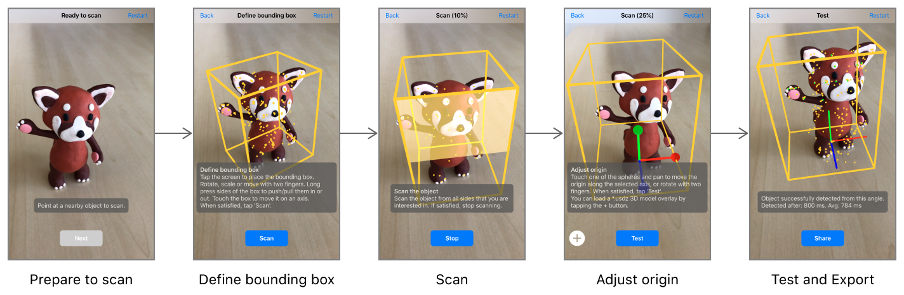

# Scanning and Detecting 3D Objects

# 扫瞄和检测3D物体

Record spatial features of real-world objects, then use the results to find those objects in the user's environment and trigger AR content.

记录真实世界物体的空间特征,然后用这些特征在用户不断移动时匹配物体并触发AR内容.


## Overview 总览

One way to build compelling AR experiences is to recognize features of the user's environment and use them to trigger the appearance of virtual content. For example, a museum app might add interactive 3D visualizations when the user points their device at a displayed sculpture or artifact. 

创建引人入胜的AR体验的一个方法就是,识别用户环境的特征并用它们来触发虚拟内容.例如,一个博物馆app需要在用户用设备指向展览的雕塑或手工艺品时展示一些3D可视化内容.

In iOS 12, you can create such AR experiences by enabling *object detection* in ARKit: Your app provides *reference objects*, which encode three-dimensional spatial features of known real-world objects, and ARKit tells your app when and where it detects the corresponding real-world objects during an AR session.

在iOS 12中,你可以用ARKit中的*object detection(物体探测)*来创造这种AR体验:你的app提供*refenrence objects(参考物体)*,它编码了已知真实物体的三维空间特征,然后ARKit会在AR session运行期间,告诉你的app什么时候在哪里在真实世界中检测到了该物体.

This sample code project provides multiple ways to make use of object detection:

本示例程序中提供了若干种方法来使用物体检测:

- Run the app to scan a real-world object and export a reference object file, which you can use in your own apps to detect that object.

  运行app来扫瞄一个真实物体,并导出一个参考物体文件,你可以在你自己的app中使用这个文件来检测那个物体.

- Use the [`ARObjectScanningConfiguration`][00] and [`ARReferenceObject`][01] classes as demonstrated in this sample app to record reference objects as part of your own asset production pipeline.

  像示例中一样,使用 [`ARObjectScanningConfiguration`][00] 和 [`ARReferenceObject`][01] 类来在你自己的app中录制参考物体然后作为自己的素材使用.

- Use [`detectionObjects`][02] in a world-tracking AR session to recognize a reference object and create AR interactions.

  在一个世界追踪的AR  session中使用 [`detectionObjects`][02] 来识别参考物体并创造AR交互.

[00]:https://developer.apple.com/documentation/arkit/arobjectscanningconfiguration
[01]:https://developer.apple.com/documentation/arkit/arreferenceobject
[02]:https://developer.apple.com/documentation/arkit/arworldtrackingconfiguration/2968177-detectionobjects

## Getting Started 开始

Requires Xcode 10.0, iOS 12.0 and an iOS device with an A9 or later processor. ARKit is not supported in iOS Simulator.

要求Xcode 10.0,iOS 12.0以及带有A9以上处理器的iOS设备.ARKit不支持iOS模拟器.

## Scan Real-World Objects with an iOS App 在iOS app中扫瞄真实物体

The programming steps to scan and define a reference object that ARKit can use for detection are simple. (See "Create a Reference Object in an AR Session" below.) However, the fidelity of the reference object you create, and thus your success at detecting that reference object in your own apps, depends on your physical interactions with the object when scanning. Build and run this app on your iOS device to walk through a series of steps for getting high-quality scan data, resulting in reference object files that you can use for detection in your own apps.

编程实现扫瞄定义参考物体以供检测的步骤非常简单.(见下面的"Create a Reference Object in an AR Session"部分)然而,你创建的参考物体的真实程度,取决于你扫瞄物体时的物理交互.在你的iOS设备上运行这个app,并通过一系列步骤来获取高质量的扫瞄数据,得到的参考物体文件可用于在你自己的app中检测物体.



1. **Prepare to scan.** When first run, the app displays a box that roughly estimates the size of whatever real-world objects appear centered in the camera view. Position the object you want to scan on a surface free of other objects (like an empty tabletop). Then move your device so that the object appears centered in the box, and tap the Next button.

   **准备扫瞄.**当第一次运行时,app会展示一个盒子,这是对出现在相机视图中间部分的真实物体的粗略估计.将你要扫瞄的物体放在空白的平面上(如一张空桌子上).然后移动你的设备来让物体出现在盒子的中心,然后点击Next按钮.

2. **Define bounding box.** Before scanning, you need to tell the app what region of the world contains the object you want to scan. Drag to move the box around in 3D, or press and hold on a side of the box and then drag to resize it. (Or, if you leave the box untouched, you can move around the object and the app will attempt to automatically fit a box around it.) Make sure the bounding box contains only features of the object you want to scan (not those from the environment it's in), then tap the Scan button.

   **定义边界盒.**在扫瞄之前,你需要告诉app你想要扫瞄的物体在哪些区域.可以以3D方式移动边界盒,或者按住拖拽来改变大小.(或者,如果你还没触摸盒子,你可以围绕物体移动,app会自动尝试调整边界盒来包围物体)确保边界盒只包含那些你想要扫瞄的特征(不要包含外界环境中的物体),然后点击Scan按钮.

3. **Scan the object.** Move around to look at the object from different angles. The app highlights parts of the bounding box to indicate when you've scanned enough to recognize the object from the corresponding direction. Be sure to scan on all sides from which you want users of your app to be able to recognize the object. The app automatically proceeds to the next step when a scan is complete, or you can tap the Stop button to proceed manually.

   **扫瞄物体.**围绕物体移动,从不同角度扫瞄.app会高亮显示对应部分,以告诉你该部分从当前角度已经扫瞄到足够的特征点.你希望你的用户从哪些角度识别这个物体,你就扫瞄哪个面.当你的扫瞄完成时,app会自动进入下一步骤,或者你可以点击Stop按钮来手动处理.

4. **Adjust origin.** The app displays x, y, and z coordinate axis lines showing the object's anchor point, or *origin*. Drag the circles to move the origin relative to the object. In this step you can also use the Add (+) button to load a 3D model in USDZ format. The app displays the model as it would appear in AR upon detecting the real-world object, and uses the model's size to adjust the scale of the reference object. Tap the Test button when done.

   **调整坐标原点.**app会显示x,y和z轴来标识出物体的锚点,或*坐标原点origin*.拖拽圆环来移动坐标原点相对物体的位置.在这一步中,你还可以使用添加(+)按钮来加载一个USDZ格式的3D模型.app会在检测到真实世界的物体后,展示这个模型,可以用这个模型的尺寸来调整参考物体的缩放比例.完成后点击Test按钮.

5. **Test and export.** The app has now created an [`ARReferenceObject`][01] and has reconfigured its session to detect it. Look at the real-world object from different angles, in various environments and lighting conditions, to verify that ARKit reliably recognizes its position and orientation. Tap the Export button to open a share sheet for saving the finished `.arobject` file. For example, you can easily send it to your development Mac using AirDrop, or send it to the Files app to save it to iCloud Drive.

   **测试及输出.**  该app现在创建了一个 [`ARReferenceObject`][01] 并重置了session的配置项以检测它.尝试从不同角度,不同环境和不同光照情况下,检验ARKit识别出的位置和朝向.点击Export按钮打开共享页面来保存最终的`.arobject` 文件.例如,你可以轻易地通过AirDrop将它发送到你的Mac,或者发送到Files app来保存到iCloud Drive.

- Note: An [`ARReferenceObject`][01] contains only the spatial feature information needed for ARKit to recognize the real-world object, and is not a displayable 3D reconstruction of that object.

  注意:一个 [`ARReferenceObject`][01] 只包含了用于ARKit识别真实物体的空间特征信息,并不是一个可供展示的3D重建.

## Detect Reference Objects in an AR Experience 在AR体验中检测参考物体

You can use an Xcode asset catalog to bundle reference objects in an app for use in detection:

你可以使用Xcode素材集来整理app中的参考物体,以供检测:

1. Open your project's asset catalog, then use the Add button (+) to add a new AR resource group.

   打开项目的asset catalog,然后使用添加(+)按钮来添加一个新的AR资源组.

2. Drag `.arobject` files from the Finder into the newly created resource group.

   从Finder中拖拽 `.arobject` 文件到新创建的资源组.

3. Optionally, for each reference object, use the inspector to provide a descriptive name for your own use.

   还可以,给第一个参考物体,使用检查器来提供一个描述用的名字以供使用.

- Note: Put all objects you want to look for in the same session into a resource group, and use separate resource groups to hold sets of objects for use in separate sessions. For example, a museum app might use separate sessions (and thus separate resource groups) for recognizing displays in different wings of the museum.

  注意:将在同一个session中检测的所有物体放在同一个资源组中,并使用单独的资源组来持有不同session用到的不同物体.例如,一个博物馆app可能会使用单独的session来识别不同分馆中的陈列品.

To enable object detection in an AR session, load the reference objects you want to detect as [`ARReferenceObject`][01] instances, provide those objects for the [`detectionObjects`][02] property of an [`ARWorldTrackingConfiguration`][31], and run an [`ARSession`][32] with that configuration:

要在AR session中启用物体检测,先将要检测的参考物体加载为[`ARReferenceObject`][01] 实例,并提供给[`ARWorldTrackingConfiguration`][31]的 [`detectionObjects`][02] 属性,并运行 [`ARSession`][32] :

```swift
let configuration = ARWorldTrackingConfiguration()
guard let referenceObjects = ARReferenceObject.referenceObjects(inGroupNamed: "gallery", bundle: nil) else {
    fatalError("Missing expected asset catalog resources.")
}
configuration.detectionObjects = referenceObjects
sceneView.session.run(configuration)
```

When ARKit detects one of your reference objects, the session automatically adds a corresponding [`ARObjectAnchor`][33] to its list of anchors. To respond to an object being recognized, implement an appropriate [`ARSessionDelegate`][34], [`ARSKViewDelegate`][35], or [`ARSCNViewDelegate`][36] method that reports the new anchor being added to the session. For example, in a SceneKit-based app you can implement  [`renderer(_:didAdd:for:)`][37] to add a 3D asset to the scene, automatically matching the position and orientation of the anchor:

当ARKit检测到你的参考物体时,session会自动添加一个相应的 [`ARObjectAnchor`][33] 到锚点列表上.要做相应操作时,实现对应的 [`ARSessionDelegate`][34], [`ARSKViewDelegate`][35], 或 [`ARSCNViewDelegate`][36] 方法来报告新锚点被添加到session上.例如,在基于SceneKit的app中,你可以实现  [`renderer(_:didAdd:for:)`][37] 来添加3D素材到场景中,以自动匹配锚点的位置和朝向:

```swift
func renderer(_ renderer: SCNSceneRenderer, didAdd node: SCNNode, for anchor: ARAnchor) {
    if let objectAnchor = anchor as? ARObjectAnchor {
        node.addChildNode(self.model)
    }
}
```

For best results with object scanning and detection, follow these tips:

要想获取最好的物体扫瞄和检测效果,请遵守以下技巧:

- ARKit looks for areas of clear, stable visual detail when scanning and detecting objects. Detailed, textured objects work better for detection than plain or reflective objects.

  ARKit需要寻找一块干净,有稳定可见细节的地方来扫瞄和检测物体.细节纹理丰富的物体效果比平坦或反射的物体识别效果好很多.

- Object scanning and detection is optimized for objects small enough to fit on a tabletop.

  物体扫瞄和检测为物体尺寸做了优化,最适合那些能放在桌面大小的物体.

- An object to be detected must have the same shape as the scanned reference object. Rigid objects work better for detection than soft bodies or items that bend, twist, fold, or otherwise change shape.

  要检测的物体必须和扫瞄的参考物体形状一样.刚体物体识别起来比其他软质物体效果更好,软质物体可能会弯曲,扭转,折叠或改变成其他形状.

- Detection works best when the lighting conditions for the real-world object to be detected are similar to those in which the original object was scanned. Consistent indoor lighting works best.

  当检测时的灯光条件与扫瞄原始物体时的灯光条件相似时,检测起来更顺利.稳定的室内灯光效果更好.

- High-quality object scanning requires peak device performance. Reference objects scanned with a recent, high-performance iOS device work well for detection on all ARKit-supported devices.

  高质量的物体扫瞄需要高性能设备.用最新款的,高性能iOS设备在识别时效果也会更好.

[31]:https://developer.apple.com/documentation/arkit/arworldtrackingconfiguration
[32]:https://developer.apple.com/documentation/arkit/arsession
[33]:https://developer.apple.com/documentation/arkit/arobjectanchor
[34]:https://developer.apple.com/documentation/arkit/arsessionDelegate
[35]:https://developer.apple.com/documentation/arkit/arscnviewdelegate
[36]:https://developer.apple.com/documentation/arkit/arskviewdelegate
[37]:https://developer.apple.com/documentation/arkit/arscnviewdelegate/2865794-renderer

## Create a Reference Object in an AR Session 在AR session中创建一个参考物体

This sample app provides one way to create reference objects. You can also scan reference objects in your own app—for example, to build asset management tools for defining AR content that goes into other apps you create.

该示例程序提供了一种方法来创建参考物体.你也可以在你的app里扫瞄参考物体——例如,为你的其他app中的AR内容创建素材管理工具.

A reference object encodes a slice of the internal spatial-mapping data that ARKit uses to track a device's position and orientation. To enable the high-quality data collection required for object scanning, run a session with [`ARObjectScanningConfiguration`][00]:

参考物体编码了一片内在的空间地图数据,ARKit用它来追踪设备的位置和朝向.要启用高质量的数据集合以供物体扫瞄,以 [`ARObjectScanningConfiguration`][00]运行session:

``` swift
let configuration = ARObjectScanningConfiguration()
configuration.planeDetection = .horizontal
sceneView.session.run(configuration, options: .resetTracking)
```
[View in Source](x-source-tag://ARObjectScanningConfiguration)

During your object-scanning AR session, scan the object from various angles to make sure you collect enough spatial data to recognize it. (If you're building your own object-scanning tools, help users walk through the same steps this sample app provides.) 

在你的物体扫瞄AR session期间,要从不同角度扫瞄物体,来确保你收集到足够的空间数据来识别它.(如果你在创建你自己的物体扫瞄工具,要像本例中一样帮助用户经过同样的步骤.)

After scanning, call [`createReferenceObject(transform:center:extent:completionHandler:)`][22] to produce an [`ARReferenceObject`][01] from a region of the user environment mapped by the session:

在扫瞄后,调用 [`createReferenceObject(transform:center:extent:completionHandler:)`][22] 来产生一个 [`ARReferenceObject`][01],它是从session构建的用户环境地图中的一个区域:

``` swift
// Extract the reference object based on the position & orientation of the bounding box.
sceneView.session.createReferenceObject(
    transform: boundingBox.simdWorldTransform,
    center: float3(), extent: boundingBox.extent,
    completionHandler: { object, error in
        if let referenceObject = object {
            // Adjust the object's origin with the user-provided transform.
            self.scannedReferenceObject =
                referenceObject.applyingTransform(origin.simdTransform)
            self.scannedReferenceObject!.name = self.scannedObject.scanName
            
            if let referenceObjectToMerge = ViewController.instance?.referenceObjectToMerge {
                ViewController.instance?.referenceObjectToMerge = nil
                
                // Show activity indicator during the merge.
                ViewController.instance?.showAlert(title: "", message: "Merging previous scan into this scan...", buttonTitle: nil)
                
                // Try to merge the object which was just scanned with the existing one.
                self.scannedReferenceObject?.mergeInBackground(with: referenceObjectToMerge, completion: { (mergedObject, error) in
                    var title: String
                    var message: String
                    
                    if let mergedObject = mergedObject {
                        mergedObject.name = self.scannedReferenceObject?.name
                        self.scannedReferenceObject = mergedObject

                        title = "Merge successful"
                        message = "The previous scan has been merged into this scan."
                        
                    } else {
                        print("Error: Failed to merge scans. \(error?.localizedDescription ?? "")")
                        title = "Merge failed"
                        message = """
                                Merging the previous scan into this scan failed. Please make sure that
                                there is sufficient overlap between both scans and that the lighting
                                environment hasn't changed drastically.
                                """
                    }
                    
                    // Hide activity indicator and inform the user about the result of the merge.
                    ViewController.instance?.dismiss(animated: true) {
                        ViewController.instance?.showAlert(title: title, message: message, buttonTitle: "OK", showCancel: false)
                    }

                    creationFinished(self.scannedReferenceObject)
                })
            } else {
                creationFinished(self.scannedReferenceObject)
            }
        } else {
            print("Error: Failed to create reference object. \(error!.localizedDescription)")
            creationFinished(nil)
        }
})
```
[View in Source](x-source-tag://ExtractReferenceObject)

When detecting a reference object, ARKit reports its position based on the origin the reference object defines. If you want to place virtual content that appears to sit on the same surface as the real-world object, make sure the reference object's origin is placed at the point where the real-world object sits. To adjust the origin after capturing an [`ARReferenceObject`][01], use the [`applyingTransform(_:)`][24] method.

当检测到参考物体时,ARKit根据定义的参考物体原点,报告它的位置.如果你想将虚拟物体放置在真实物体的同一平面上,请确保参考物体的坐标原点是设置在真实物体的放置处.要在捕捉到 [`ARReferenceObject`][01]后调整原点,请使用[`applyingTransform(_:)`][24] 方法.

After you obtain an [`ARReferenceObject`][01], you can either use it immediately for detection (see "Detect Reference Objects in an AR Experience" above) or save it as an `.arobject` file for use in later sessions or other ARKit-based apps. To save an object to a file, use the [`export`][23] method. In that method, you can provide a picture of the real-world object for Xcode to use as a preview image.

当你获得 [`ARReferenceObject`][01]后,你可以直接将其用来检测3D物体或保存为一个 `.arobject` 文件以供使用.要保存为一个文件,调用 [`export`][23] 方法.在该方法中,你可以提供一张现实世界物体照片来做为Xcode预览图.

[22]:https://developer.apple.com/documentation/arkit/arsession/3001731-createreferenceobjectwithtransfo
[23]:https://developer.apple.com/documentation/arkit/arreferenceobject/2968198-export
[24]:https://developer.apple.com/documentation/arkit/arreferenceobject/2977514-applyingtransform
